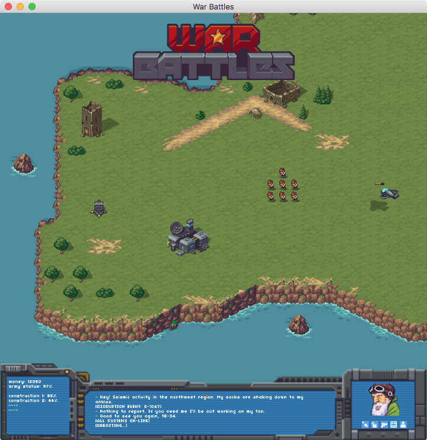

# War Battles

War Battles is a complete game art pack to make a sci-fi RTS game in the style of the 16-bit console era. It includes everything you need, from environment tilemaps, unit sprites, resource sprites, HUD elements, icons and effects.

A zip file with the whole project is available here: https://github.com/defold/defold-examples/releases/download/0.2.0/war-battles.zip

by Luis Zuno
web: http://ansimuz.com/
twitter: https://twitter.com/ansimuz

Please give credit to Luis Zuno when you use the art in a game
